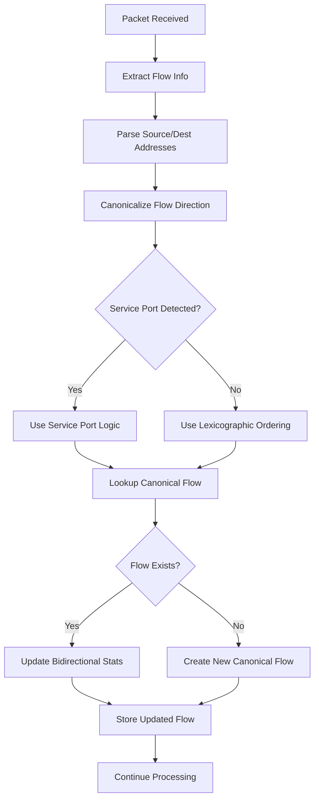
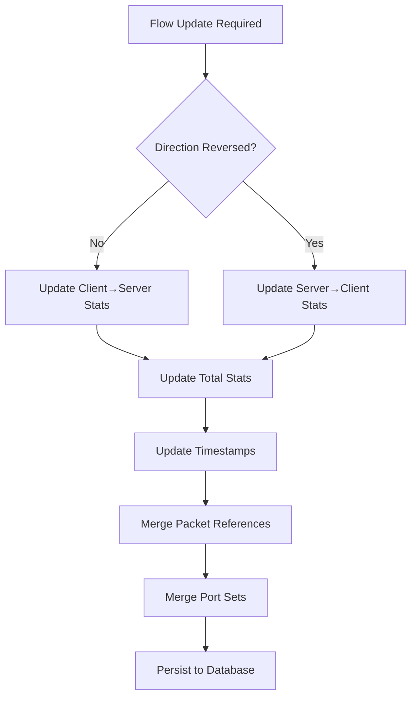

# Design Document

## Overview

This design implements bidirectional flow aggregation for the existing Go PCAP Importer to fix the protocol classification issue where request-response communications create separate flow records instead of being aggregated into a single bidirectional flow entry. The solution modifies the repository layer's flow handling logic while maintaining the established architectural patterns of interface-driven design and testability.

The design follows existing architectural principles:
- Interface-first design for new flow canonicalization components
- Repository pattern enhancement for bidirectional flow persistence
- Clean separation between lib/ (reusable) and internal/ (application-specific) code
- Database regeneration approach for schema changes

## Architecture

### High-Level Component Architecture

```
┌─────────────────────────────────────────────────────────────┐
│                    Existing PCAP Parser                    │
│  ┌─────────────────┐ ┌─────────────────┐ ┌─────────────────┐│
│  │  GopacketParser │ │   Repository    │ │   DNS Processor ││
│  │                 │ │                 │ │                 ││
│  │ • Packet Parse  │ │ • Device CRUD   │ │ • DNS Correlation│
│  │ • Flow Analysis │ │ • Flow Storage  │ │ • Hostname Res  ││
│  │ • Device Disc   │ │ • SQLite Impl   │ │ • Query Analysis││
│  └─────────────────┘ └─────────────────┘ └─────────────────┘│
└─────────────────────────────────────────────────────────────┘
                                │
                                │ Enhanced with
                                ▼
┌─────────────────────────────────────────────────────────────┐
│              Bidirectional Flow Enhancement                │
│  ┌─────────────────┐ ┌─────────────────┐ ┌─────────────────┐│
│  │Flow Canonicalizer│ │Enhanced Flow    │ │Updated Models   ││
│  │                 │ │Repository       │ │                 ││
│  │ • Service Port  │ │ • Bidirectional │ │ • Extended Flow ││
│  │   Detection     │ │   Lookup        │ │   Statistics    ││
│  │ • Direction     │ │ • Statistics    │ │ • Service Port  ││
│  │   Normalization │ │   Aggregation   │ │   Mapping       ││
│  └─────────────────┘ └─────────────────┘ └─────────────────┘│
└─────────────────────────────────────────────────────────────┘
```

### Integration Points

The bidirectional flow enhancement integrates with existing components:

1. **Repository Enhancement**: Modify existing `UpsertFlow` method with bidirectional logic
2. **Flow Model Extension**: Add new columns for bidirectional statistics
3. **Service Port Detection**: New component for identifying client-server relationships
4. **Flow Canonicalization**: New component for normalizing flow direction

## Components and Interfaces

### 1. Flow Canonicalizer (lib/helper/)

New component for determining canonical flow direction:

```go
// lib/helper/flow_canonicalizer.go
type FlowCanonicalizer interface {
    CanonicalizeFlow(srcIP, dstIP string, srcPort, dstPort uint16, protocol string) (canonicalSrc, canonicalDst string, isReversed bool)
    IsServicePort(port uint16, protocol string) bool
    GetWellKnownPorts() map[uint16]string
}

type FlowCanonicalizerImpl struct {
    wellKnownPorts map[uint16]string
}

// Well-known service ports mapping
var WellKnownServicePorts = map[uint16]string{
    80:    "HTTP",
    443:   "HTTPS", 
    8080:  "HTTP",
    8443:  "HTTPS",
    8000:  "HTTP",
    4840:  "OPC UA",
    502:   "Modbus",
    44818: "EtherNet/IP",
    2222:  "EtherNet/IP",
    53:    "DNS",
    161:   "SNMP",
    162:   "SNMP",
    22:    "SSH",
    23:    "Telnet",
}
```

### 2. Enhanced Flow Model (lib/model/)

Extends existing Flow struct with bidirectional statistics:

```go
// lib/model/packet.go (additions to Flow struct)
type Flow struct {
    // ...existing fields...
    ID                  int64
    Source              string
    Destination         string
    Protocol            string
    Packets             int      // Total packets (both directions)
    Bytes               int      // Total bytes (both directions)
    FirstSeen           time.Time
    LastSeen            time.Time
    SourceDeviceID      int64
    DestinationDeviceID int64
    PacketRefs          []int64
    MinPacketSize       int
    MaxPacketSize       int
    SourcePorts         *Set
    DestinationPorts    *Set
    
    // New bidirectional statistics fields
    PacketsClientToServer int `json:"packets_client_to_server"`
    PacketsServerToClient int `json:"packets_server_to_client"`
    BytesClientToServer   int `json:"bytes_client_to_server"`
    BytesServerToClient   int `json:"bytes_server_to_client"`
}
```

### 3. Enhanced Repository Interface (internal/repository/)

Extends existing Repository with bidirectional flow methods:

```go
// internal/repository/repository.go (no interface changes needed)
// Existing UpsertFlow method will be enhanced internally

// internal/repository/sqlite_repository.go (enhanced implementation)
type SQLiteRepository struct {
    // ...existing fields...
    flowCanonicalizer FlowCanonicalizer // New dependency
}

// Enhanced constructor
func NewSQLiteRepositoryWithCanonicalizer(dbPath string, canonicalizer FlowCanonicalizer) (*SQLiteRepository, error) {
    // Implementation
}
```

## Data Models

### Enhanced Database Schema

The database schema will be regenerated with new columns:

```sql
-- Enhanced flows table with bidirectional statistics
CREATE TABLE flows (
    id INTEGER PRIMARY KEY AUTOINCREMENT,
    source TEXT NOT NULL,
    destination TEXT NOT NULL,
    protocol TEXT NOT NULL,
    packets INTEGER NOT NULL DEFAULT 0,                    -- Total packets (both directions)
    bytes INTEGER NOT NULL DEFAULT 0,                      -- Total bytes (both directions)
    first_seen DATETIME NOT NULL,
    last_seen DATETIME NOT NULL,
    source_device_id INTEGER,
    destination_device_id INTEGER,
    min_packet_size INTEGER NOT NULL DEFAULT 0,
    max_packet_size INTEGER NOT NULL DEFAULT 0,
    packet_refs TEXT,                                      -- JSON array
    source_ports TEXT,                                     -- JSON set
    destination_ports TEXT,                                -- JSON set
    
    -- New bidirectional statistics columns
    packets_client_to_server INTEGER NOT NULL DEFAULT 0,   -- Client → Server packets
    packets_server_to_client INTEGER NOT NULL DEFAULT 0,   -- Server → Client packets  
    bytes_client_to_server INTEGER NOT NULL DEFAULT 0,     -- Client → Server bytes
    bytes_server_to_client INTEGER NOT NULL DEFAULT 0,     -- Server → Client bytes
    
    FOREIGN KEY (source_device_id) REFERENCES devices(id),
    FOREIGN KEY (destination_device_id) REFERENCES devices(id)
);

-- Index for efficient bidirectional flow lookup
CREATE INDEX idx_flows_canonical ON flows(source, destination, protocol);
CREATE INDEX idx_flows_reverse_lookup ON flows(destination, source, protocol);
```

## Flow Processing Logic

### Flow Canonicalization Algorithm

```go
// Pseudocode for flow canonicalization
func (fc *FlowCanonicalizerImpl) CanonicalizeFlow(srcIP, dstIP string, srcPort, dstPort uint16, protocol string) (string, string, bool) {
    // 1. Check for well-known service ports
    srcIsService := fc.IsServicePort(srcPort, protocol)
    dstIsService := fc.IsServicePort(dstPort, protocol)
    
    if dstIsService && !srcIsService {
        // Standard client → server pattern
        return fmt.Sprintf("%s:%d", srcIP, srcPort), fmt.Sprintf("%s:%d", dstIP, dstPort), false
    } else if srcIsService && !dstIsService {
        // Reverse direction (server → client response)
        return fmt.Sprintf("%s:%d", dstIP, dstPort), fmt.Sprintf("%s:%d", srcIP, srcPort), true
    } else {
        // 2. Fallback: Lexicographic ordering
        srcAddr := fmt.Sprintf("%s:%d", srcIP, srcPort)
        dstAddr := fmt.Sprintf("%s:%d", dstIP, dstPort)
        
        if srcAddr < dstAddr {
            return srcAddr, dstAddr, false
        } else {
            return dstAddr, srcAddr, true
        }
    }
}
```

### Enhanced UpsertFlow Logic

```go
// Enhanced UpsertFlow implementation
func (r *SQLiteRepository) UpsertFlow(flow *model.Flow) error {
    if err := flow.Validate(); err != nil {
        return err
    }
    
    // Extract IP and port information
    srcIP, srcPort, err := parseAddress(flow.Source)
    if err != nil {
        return err
    }
    dstIP, dstPort, err := parseAddress(flow.Destination)
    if err != nil {
        return err
    }
    
    // Canonicalize flow direction
    canonicalSrc, canonicalDst, isReversed := r.flowCanonicalizer.CanonicalizeFlow(
        srcIP, dstIP, srcPort, dstPort, flow.Protocol)
    
    // Look up existing flow using canonical direction
    existingFlow, err := r.findFlowByCanonicalTuple(canonicalSrc, canonicalDst, flow.Protocol)
    if err != nil && err != sql.ErrNoRows {
        return err
    }
    
    if existingFlow != nil {
        // Update existing flow with new packet data
        return r.updateBidirectionalFlow(existingFlow, flow, isReversed)
    } else {
        // Create new flow in canonical direction
        return r.createCanonicalFlow(flow, canonicalSrc, canonicalDst, isReversed)
    }
}
```

## Error Handling

### Flow Processing Error Handling

```go
// Error types for flow processing
type FlowProcessingError struct {
    Flow    *model.Flow
    Err     error
    Context string
    Action  string // "canonicalize", "lookup", "update", "create"
}

func (e *FlowProcessingError) Error() string {
    return fmt.Sprintf("flow processing error [%s]: %s - %s", e.Action, e.Context, e.Err.Error())
}

// Error handling strategy
type FlowErrorHandler interface {
    HandleCanonicalizationError(flow *model.Flow, err error) error
    HandleLookupError(canonicalSrc, canonicalDst, protocol string, err error) error
    HandleUpdateError(flow *model.Flow, err error) error
}
```

### Graceful Degradation Strategy

1. **Address Parsing Failures**: Log error, skip flow processing for that packet
2. **Canonicalization Failures**: Fall back to lexicographic ordering
3. **Database Lookup Failures**: Retry with exponential backoff, then create new flow
4. **Update Failures**: Log error, continue with next packet
5. **Constraint Violations**: Retry lookup and update in case of race conditions

## Testing Strategy

### Unit Testing Approach

Following existing London School TDD patterns:

```go
// internal/testutil/mock_flow_canonicalizer.go
type MockFlowCanonicalizer struct {
    mock.Mock
}

func (m *MockFlowCanonicalizer) CanonicalizeFlow(srcIP, dstIP string, srcPort, dstPort uint16, protocol string) (string, string, bool) {
    args := m.Called(srcIP, dstIP, srcPort, dstPort, protocol)
    return args.String(0), args.String(1), args.Bool(2)
}

func (m *MockFlowCanonicalizer) IsServicePort(port uint16, protocol string) bool {
    args := m.Called(port, protocol)
    return args.Bool(0)
}
```

### Test Scenarios

```go
// Test cases for bidirectional flow aggregation
func TestBidirectionalFlowAggregation(t *testing.T) {
    testCases := []struct {
        name           string
        request        *model.Flow  // Client → Server
        response       *model.Flow  // Server → Client
        expectedFlow   *model.Flow  // Expected aggregated result
    }{
        {
            name: "HTTP Request-Response",
            request: &model.Flow{
                Source: "192.168.1.10:45678", 
                Destination: "192.168.1.20:80",
                Protocol: "HTTP",
                Packets: 1, Bytes: 100,
            },
            response: &model.Flow{
                Source: "192.168.1.20:80",
                Destination: "192.168.1.10:45678", 
                Protocol: "HTTP",
                Packets: 1, Bytes: 500,
            },
            expectedFlow: &model.Flow{
                Source: "192.168.1.10:45678",
                Destination: "192.168.1.20:80",
                Protocol: "HTTP",
                Packets: 2, Bytes: 600,
                PacketsClientToServer: 1, BytesClientToServer: 100,
                PacketsServerToClient: 1, BytesServerToClient: 500,
            },
        },
        // Additional test cases for HTTPS, OPC UA, Modbus, etc.
    }
}
```

### Integration Testing

1. **End-to-End Flow Processing**: Test complete pipeline with bidirectional packet sequences
2. **Database Integration**: Test flow persistence and retrieval with new schema  
3. **Service Port Detection**: Test canonical direction determination for various protocols
4. **Performance Testing**: Ensure bidirectional logic doesn't degrade performance

## Implementation Flow

### Bidirectional Flow Processing Flow



### Database Update Flow



## Performance Considerations

### Optimization Strategies

1. **Canonical Flow Lookup Optimization**:
   - Database indexes on canonical flow tuples
   - Prepared statements for frequent queries
   - Single query for both forward and reverse direction lookup

2. **Address Parsing Optimization**:
   - Cache parsed addresses to avoid repeated parsing
   - Pre-compile regular expressions for address extraction
   - Validate address format only once per unique address

3. **Database Optimization**:
   - Batch flow updates to reduce database calls
   - Use transactions for consistency
   - Index on (source, destination, protocol) for fast lookups

### Memory Management

- Minimal memory overhead for canonicalization logic
- Reuse address parsing results within packet batch
- Bounded packet reference arrays to prevent memory bloat
- Connection pooling for database operations

## Success Criteria

1. **Functional**: HTTP request-response pairs create exactly one flow record
2. **Protocol Accuracy**: Service ports correctly identified as destinations
3. **Statistics Accuracy**: Bidirectional byte/packet counts are correctly aggregated
4. **Performance**: Flow processing speed maintained within 5% of baseline
5. **Data Integrity**: No duplicate flows, all statistics properly aggregated
6. **Error Resilience**: System continues processing when individual flows fail

## Dependencies

- Existing SQLite repository implementation
- Current Flow model and validation logic  
- Packet processing pipeline in gopacket parser
- Database schema regeneration approach
- Address parsing utilities in lib/helper/
