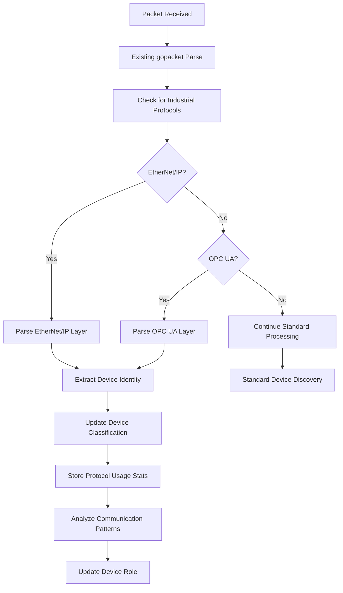
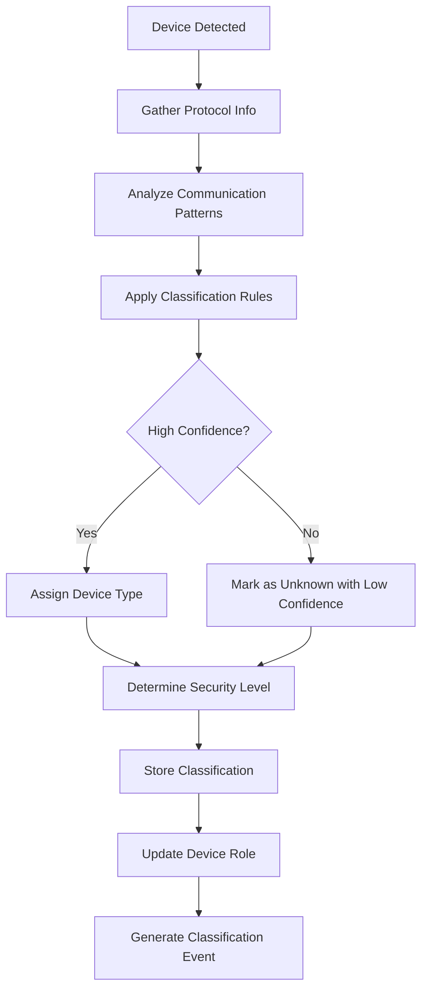

# Design Document

## Overview

This design implements IEC 62443 device classification and industrial protocol detection by extending the existing Go PCAP Importer architecture. The solution adds EtherNet/IP and OPC UA protocol parsing capabilities while maintaining the established patterns of interface-driven design, dependency injection, and testability.

The design follows the existing architectural principles:
- Interface-first design for all new components
- Repository pattern for data persistence
- London School TDD with comprehensive mocking
- Integration with the existing gopacket parsing pipeline
- Clear separation between lib/ (reusable) and internal/ (application-specific) code

## Architecture

### High-Level Component Architecture

```
┌─────────────────────────────────────────────────────────────┐
│                    Existing PCAP Parser                    │
│  ┌─────────────────┐ ┌─────────────────┐ ┌─────────────────┐│
│  │  GopacketParser │ │   Repository    │ │   DNS Processor ││
│  │                 │ │                 │ │                 ││
│  │ • Packet Parse  │ │ • Device CRUD   │ │ • DNS Correlation│
│  │ • Flow Analysis │ │ • Flow Storage  │ │ • Hostname Res  ││
│  │ • Device Disc   │ │ • SQLite Impl   │ │ • Query Analysis││
│  └─────────────────┘ └─────────────────┘ └─────────────────┘│
└─────────────────────────────────────────────────────────────┘
                                │
                                │ Enhanced with
                                ▼
┌─────────────────────────────────────────────────────────────┐
│              Industrial Protocol Enhancement                │
│  ┌─────────────────┐ ┌─────────────────┐ ┌─────────────────┐│
│  │Industrial Parser│ │Device Classifier│ │Enhanced Models  ││
│  │                 │ │                 │ │                 ││
│  │ • EtherNet/IP   │ │ • Device Types  │ │ • Industrial    ││
│  │ • OPC UA        │ │ • Role Analysis │ │   Device        ││
│  │ • Protocol Det  │ │ • Pattern Match │ │ • Protocol Info ││
│  └─────────────────┘ └─────────────────┘ └─────────────────┘│
└─────────────────────────────────────────────────────────────┘
```
### Integration Points

The industrial protocol enhancement integrates with existing components:

1. **GopacketParser Extension**: Add industrial protocol layer detection
2. **Repository Enhancement**: Extend with industrial device queries
3. **Device Model Extension**: Add industrial-specific fields
4. **DNS Processor Integration**: Correlate industrial device hostnames

## Components and Interfaces

### 1. Industrial Protocol Layers (lib/layers/)

New protocol layer implementations following existing patterns:

```go
// lib/layers/ethernetip.go
type EtherNetIP struct {
    layers.BaseLayer
    Command         uint16
    Length          uint16
    SessionHandle   uint32
    Status          uint32
    SenderContext   []byte
    Options         uint32
    // CIP-specific fields
    Service         uint8
    ClassID         uint16
    InstanceID      uint16
    AttributeID     uint16
}

// lib/layers/opcua.go  
type OPCUA struct {
    layers.BaseLayer
    MessageType     string
    ChunkType       string
    MessageSize     uint32
    SecureChannelID uint32
    // Security and service-specific fields
    SecurityPolicy  string
    SecurityMode    string
    ServiceType     string
}
```

### 2. Industrial Protocol Parser (internal/parser/)

Extends existing PacketParser interface:

```go
// internal/parser/industrial_parser.go
type IndustrialProtocolParser interface {
    ParseIndustrialProtocols(packet gopacket.Packet) ([]IndustrialProtocolInfo, error)
    DetectDeviceType(protocols []IndustrialProtocolInfo, flows []Flow) IndustrialDeviceType
    AnalyzeCommunicationPatterns(flows []Flow) []CommunicationPattern
}

type IndustrialProtocolInfo struct {
    Protocol        string
    Port           uint16
    Direction      string
    DeviceIdentity map[string]interface{}
    SecurityInfo   map[string]interface{}
    ServiceType    string
}
```###
 3. Device Classifier (internal/iec62443/)

New component for industrial device classification:

```go
// internal/iec62443/device_classifier.go
type DeviceClassifier interface {
    ClassifyDevice(device Device, protocols []IndustrialProtocolInfo, patterns []CommunicationPattern) IndustrialDeviceClassification
    UpdateDeviceRole(deviceID string, newRole IndustrialDeviceRole) error
    GetDevicesByType(deviceType IndustrialDeviceType) ([]Device, error)
}

type IndustrialDeviceClassification struct {
    DeviceType      IndustrialDeviceType
    Role           IndustrialDeviceRole
    Confidence     float64
    Protocols      []string
    SecurityLevel  SecurityLevel
    LastUpdated    time.Time
}
```

### 4. Enhanced Repository Interface (internal/repository/)

Extends existing Repository with industrial-specific methods:

```go
// internal/repository/repository.go (additions)
type Repository interface {
    // Existing methods...
    SaveDevices(devices []Device) error
    GetDevices() ([]Device, error)
    
    // New industrial-specific methods
    SaveIndustrialDeviceInfo(deviceID string, info IndustrialDeviceInfo) error
    GetIndustrialDevicesByType(deviceType IndustrialDeviceType) ([]Device, error)
    SaveProtocolUsageStats(deviceID string, stats ProtocolUsageStats) error
    GetDeviceClassificationHistory(deviceID string) ([]IndustrialDeviceClassification, error)
}
```

## Data Models

### Enhanced Device Model (lib/model/)

Extends existing Device struct with industrial fields:

```go
// lib/model/industrial_device.go
type IndustrialDeviceType string

const (
    DeviceTypePLC              IndustrialDeviceType = "PLC"
    DeviceTypeHMI              IndustrialDeviceType = "HMI"
    DeviceTypeSCADA            IndustrialDeviceType = "SCADA"
    DeviceTypeHistorian        IndustrialDeviceType = "Historian"
    DeviceTypeEngWorkstation   IndustrialDeviceType = "EngineeringWorkstation"
    DeviceTypeIODevice         IndustrialDeviceType = "IODevice"
    DeviceTypeSensor           IndustrialDeviceType = "Sensor"
    DeviceTypeActuator         IndustrialDeviceType = "Actuator"
    DeviceTypeUnknown          IndustrialDeviceType = "Unknown"
)

type IndustrialDeviceRole string

const (
    RoleController    IndustrialDeviceRole = "Controller"
    RoleOperator      IndustrialDeviceRole = "Operator"
    RoleEngineer      IndustrialDeviceRole = "Engineer"
    RoleDataCollector IndustrialDeviceRole = "DataCollector"
    RoleFieldDevice   IndustrialDeviceRole = "FieldDevice"
)

type SecurityLevel int

const (
    SecurityLevelUnknown SecurityLevel = 0
    SecurityLevel1       SecurityLevel = 1
    SecurityLevel2       SecurityLevel = 2
    SecurityLevel3       SecurityLevel = 3
    SecurityLevel4       SecurityLevel = 4
)
```### Ind
ustrial Device Information Model

```go
// lib/model/industrial_device.go (continued)
type IndustrialDeviceInfo struct {
    DeviceID           string
    DeviceType         IndustrialDeviceType
    Role              IndustrialDeviceRole
    Confidence        float64
    Protocols         []string
    SecurityLevel     SecurityLevel
    Vendor            string
    ProductName       string
    SerialNumber      string
    FirmwareVersion   string
    LastSeen          time.Time
    CreatedAt         time.Time
    UpdatedAt         time.Time
}

type ProtocolUsageStats struct {
    DeviceID          string
    Protocol          string
    PacketCount       int64
    ByteCount         int64
    FirstSeen         time.Time
    LastSeen          time.Time
    CommunicationRole string // "client", "server", "both"
    PortsUsed         []uint16
}

type CommunicationPattern struct {
    SourceDevice      string
    DestinationDevice string
    Protocol          string
    Frequency         time.Duration
    DataVolume        int64
    PatternType       string // "periodic", "event-driven", "continuous"
    Criticality       string // "low", "medium", "high", "critical"
}
```

### Database Schema Extensions

Extends existing SQLite schema:

```sql
-- New tables for industrial device information
CREATE TABLE IF NOT EXISTS industrial_devices (
    device_id TEXT PRIMARY KEY,
    device_type TEXT NOT NULL,
    role TEXT NOT NULL,
    confidence REAL NOT NULL,
    protocols TEXT NOT NULL, -- JSON array
    security_level INTEGER NOT NULL,
    vendor TEXT,
    product_name TEXT,
    serial_number TEXT,
    firmware_version TEXT,
    last_seen DATETIME NOT NULL,
    created_at DATETIME NOT NULL,
    updated_at DATETIME NOT NULL,
    FOREIGN KEY (device_id) REFERENCES devices(address)
);

CREATE TABLE IF NOT EXISTS protocol_usage_stats (
    id INTEGER PRIMARY KEY AUTOINCREMENT,
    device_id TEXT NOT NULL,
    protocol TEXT NOT NULL,
    packet_count INTEGER NOT NULL,
    byte_count INTEGER NOT NULL,
    first_seen DATETIME NOT NULL,
    last_seen DATETIME NOT NULL,
    communication_role TEXT NOT NULL,
    ports_used TEXT NOT NULL, -- JSON array
    FOREIGN KEY (device_id) REFERENCES devices(address)
);

CREATE TABLE IF NOT EXISTS communication_patterns (
    id INTEGER PRIMARY KEY AUTOINCREMENT,
    source_device TEXT NOT NULL,
    destination_device TEXT NOT NULL,
    protocol TEXT NOT NULL,
    frequency_ms INTEGER NOT NULL,
    data_volume INTEGER NOT NULL,
    pattern_type TEXT NOT NULL,
    criticality TEXT NOT NULL,
    created_at DATETIME NOT NULL,
    FOREIGN KEY (source_device) REFERENCES devices(address),
    FOREIGN KEY (destination_device) REFERENCES devices(address)
);
```## Err
or Handling

### Protocol Parsing Error Handling

```go
// Error types for industrial protocol parsing
type IndustrialProtocolError struct {
    Protocol string
    Packet   gopacket.Packet
    Err      error
    Context  string
}

func (e *IndustrialProtocolError) Error() string {
    return fmt.Sprintf("industrial protocol error [%s]: %s - %s", e.Protocol, e.Context, e.Err.Error())
}

// Error handling strategy
type ErrorHandler interface {
    HandleProtocolError(err *IndustrialProtocolError) error
    HandleClassificationError(deviceID string, err error) error
    HandleValidationError(data interface{}, err error) error
}
```

### Graceful Degradation Strategy

1. **Malformed Packets**: Log error, continue with next packet
2. **Incomplete Protocol Data**: Use partial data with lower confidence
3. **Classification Failures**: Fall back to generic device type
4. **Database Errors**: Retry with exponential backoff
5. **Validation Errors**: Reject invalid data, log for debugging

## Testing Strategy

### Unit Testing Approach

Following existing London School TDD patterns:

```go
// internal/testutil/mock_industrial_parser.go
type MockIndustrialProtocolParser struct {
    mock.Mock
}

func (m *MockIndustrialProtocolParser) ParseIndustrialProtocols(packet gopacket.Packet) ([]IndustrialProtocolInfo, error) {
    args := m.Called(packet)
    return args.Get(0).([]IndustrialProtocolInfo), args.Error(1)
}

// internal/testutil/mock_device_classifier.go
type MockDeviceClassifier struct {
    mock.Mock
}

func (m *MockDeviceClassifier) ClassifyDevice(device Device, protocols []IndustrialProtocolInfo, patterns []CommunicationPattern) IndustrialDeviceClassification {
    args := m.Called(device, protocols, patterns)
    return args.Get(0).(IndustrialDeviceClassification)
}
```

### Test Data Strategy

```go
// Test PCAP files for industrial protocols
// internal/parser/test_ethernetip.pcap - EtherNet/IP test data
// internal/parser/test_opcua.pcap - OPC UA test data
// internal/parser/test_mixed_industrial.pcap - Mixed protocol test data

// Test device scenarios
func CreateTestPLCDevice() Device { /* ... */ }
func CreateTestHMIDevice() Device { /* ... */ }
func CreateTestSCADADevice() Device { /* ... */ }
```

### Integration Testing

1. **End-to-End PCAP Processing**: Test complete pipeline with industrial PCAP files
2. **Database Integration**: Test industrial data persistence and retrieval
3. **Classification Accuracy**: Test device classification with known industrial network captures
4. **Performance Testing**: Ensure industrial protocol parsing doesn't degrade performance

### Test Coverage Requirements

- **Unit Tests**: 90%+ coverage for all new components
- **Integration Tests**: Cover all major industrial protocol scenarios
- **Error Path Testing**: Test all error handling scenarios
- **Performance Tests**: Benchmark industrial protocol parsing performance## I
mplementation Flow

### Protocol Detection Flow



### Device Classification Flow



## Performance Considerations

### Optimization Strategies

1. **Protocol Detection Optimization**:
   - Port-based pre-filtering before deep packet inspection
   - Lazy parsing of protocol details only when needed
   - Caching of protocol parsers to avoid repeated initialization

2. **Classification Optimization**:
   - Batch classification updates to reduce database calls
   - In-memory caching of device classifications
   - Incremental updates rather than full re-classification

3. **Database Optimization**:
   - Indexed queries on device_type and protocol fields
   - Batch inserts for protocol usage statistics
   - Prepared statements for frequent queries

### Memory Management

- Stream processing for large PCAP files
- Bounded queues for protocol parsing pipeline
- Periodic cleanup of old classification data
- Connection pooling for database operations

## Security Considerations

### Data Protection

1. **Sensitive Data Handling**: Remove or hash sensitive industrial data (serial numbers, proprietary identifiers)
2. **Protocol Security Analysis**: Detect unencrypted industrial communications
3. **Access Control**: Ensure industrial device data follows existing access patterns
4. **Audit Logging**: Log all device classification changes for compliance

### Validation and Sanitization

1. **Input Validation**: Validate all industrial protocol fields
2. **SQL Injection Prevention**: Use parameterized queries for all database operations
3. **Buffer Overflow Protection**: Validate packet sizes and field lengths
4. **Error Information Disclosure**: Sanitize error messages to prevent information leakage